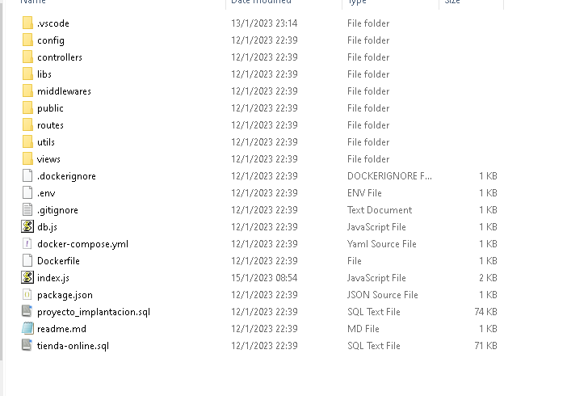
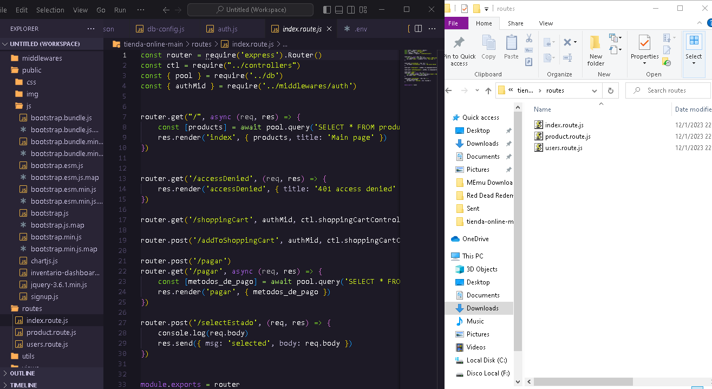

# proyecto tienda online

La finalidad de este sistema es la de automatizar el área de ventas de una pequeña tienda (negocio) el cual apunta hacia el mercado de los útiles escolares, en este se pueden ver los productos en el inventario, agregar nuevos productos y actualizarlos, existen varios tipos de roles o usuarios los cuales van a tener distintas funciones, uno de estos es el contador que se encarga de confirmar o rechazar los pagos, el inventario el cual ve un sencillo reporte de ventas y añade nuevos productos al inventario del sistema, tenemos al administrador que se encarga de registrar a los demás usuarios del sistema  ademas de tener la capacidad de cambiar sus estatus de ACTIVO a BLOQUEADO no permitiéndoles iniciar sesión en el sistema, por ultimo tenemos al mas importante el cliente este realiza todas las funcionalidades de un cliente en cualquier E-Commerce, compra productos, filtra productos por categoría, selecciona un producto para ver sus detalles, añade productos al carrito de compra, realiza el pago, el cual el decide como efectuarlo si por transferencia-pago móvil en caso de pagar en bolívares o tarjeta de crédito en caso de pagar con dólares, de los productos que añadió previamente a su carrito, y después de realizar esta puede ver una lista de sus ordenes o compras la cual se ve en la barra superior de navegación.

## Como correr la applicacion caso de user Xampp
- instalar [https://nodejs.org/en/download/](Nodejs)
- instalar [https://www.apachefriends.org/](XAMPP)
- clona este repositorio ´´´ git clone https://github.com/DURANalcala/tienda-online ´´´
- Instala las dependencias del proyecto ´´´ npm install ´´´
- Correr el proyecto con este comando ```npm start```


## Como correr la applicacion en caso de usar docker
- [https://www.docker.com/](Instalar Docker)
- clona este repositorio ´´´ git clone https://github.com/DURANalcala/tienda-online ´´´
- [https://docs.docker.com/compose/install/](Instala Docker Compose)
- Correr todos los contenedor con ´´´ docker-compose up --build ´´´

## Conceptos:

<p>
<b>JSON</b>: Se trata de un formato para guardar e intercambiar información que cualquier persona pueda leer. Los archivos json contienen solo texto y usan la extensión .json . es un formato que almacena información estructurada y se utiliza principalmente para transferir datos entre un servidor y un cliente.
</p>
<p>
<b>JavaScript</b>: es un lenguaje de programación ligero, interpretado, o compilado justo-a-tiempo (just-in-time) con funciones de primera clase. Si bien es más conocido como un lenguaje de scripting (secuencias de comandos) para páginas web.
</p>
<p>
<b>Css</b>: El CSS es lo que se llama un lenguaje de hojas de estilo en cascada y se utiliza para estilizar elementos escritos en un lenguaje de marcado como HTML. Separa el contenido de la representación visual del sitio.
</p>
<p>
<b>Mysql</b>: es un sistema de gestión de bases de datos relacional, Cualquier programa que imaginemos tarde o temprano necesitará almacenar datos en algún lugar, como mínimo para poder almacenar la lista de usuarios autorizados, sus permisos y propiedades.
</p>
<p>
<b>Docker</b>: es un proyecto de código abierto para automatizar la implementación de aplicaciones como contenedores portátiles y autosuficientes que se pueden ejecutar en la nube o localmente.
</p>

## Tecnica de Hashing usada

<p>
 <b>MD5</b>: En criptografía, MD5 (abreviatura de Message-Digest Algorithm 5, Algoritmo de Resumen del Mensaje 5) es un algoritmo de reducción criptográfico de 128 bits ampliamente usado. Uno de sus usos es el de comprobar que algún archivo no haya sido modificado.
</p>

Contenedor de la página web 




Dentro de la carpeta. vscode tenemos el launch.jason:  archivo para definir configuraciones de depuración(Depurar: La depuración de programas es el proceso de identificar y corregir errores de programación.​). solo se necesita un launch.json  si desea usar el depurador y la página web requiere que se ejecute en un servidor web, no solo en un sistema de archivos local


Dentro de la carpeta config tenemos el archivo db-config.js : este es el archivo que hace la conexión con la base de datos SQL


Dentro de la carpeta controles tenemos  4 archivos: index.js , product.js , shoppingCart.js y user.js : estos son partes del modelo vista-controlador, el modelos maneja la data, lógica y reglas de la página web  y la vista despliega la interfaz para el usuario, el controlador acepta las peticiones del usuario, interactúa con el modelo y selecciona la vista correcta para la petición, en este caso el index es para la pagina principal, el product para la sección de productos,shoppingcart para la sección del carro de compra y user es la ruta del usuario dependiendo de su nivel de usuario


Dentro de la carpeta libs tenemos el archivo multer.js : este archivo sirve para agilizar la subida de archivos en javascripts


Dentro de la carpeta middlewares tenemos el archivo auth.js, middleware es un forma con el que las diferentes aplicaciones o carpetas se comunican entre sí y la función de auth.js en autenticar al login de usuario de acuerdo a su nivel de usuario para acceder a la base de datos (admin, inventario) 


Dentro de la carpeta public tenemos otras 3 carpetas: css , img y js.
La carpeta css contiene las hojas de estilo de las distintas ventanas
La carpeta img es el repositorio de las imágenes que se muestran en la pagina web
La carpeta js contiene configuración para el front end, sobretodo para el framework boostrap



En la carpeta routes hay 3 archivos: index.route.je , product.route.js y users.route.js estos tienen la configuración de las rutas que seguirá el usuario dependiendo de su nivel, por ejemplo el admin podrá acceder a su tablero de administrador que le da acceso a los modulos: registrarempleado, bloquear/desbloquear usuario, inventario


La carpeta utils contiene 3 archivos: authenticate.js, redirecter.js y validator.js, esta carpeta sirve para almacenar funciones que van a reutilizarse en el resto de repositorio.
Por ejemplo: validator.js es una función para validar la contraseña en el login


En la carpeta views están todas las ventanas que aparecerán en la pagina web 
Volvemos a la carpeta raíz del contenedor:

Dockerfile: es un archivo o documento de texto simple que incluye una serie de instrucciones que se necesitan ejecutar de manera consecutiva para cumplir con los procesos necesarios para la creación de la imagen
A este conjunto de instrucciones se le conoce como línea de comandos y serán los encargados de indicar los pasos a seguir para el ensamblaje de una imagen en Docker, es decir, los elementos necesarios para el desarrollo de un contenedor en Docker.
Db.js: este archivo conecta la base de datos con la pagina web 
Package.json: este archivo es el “corazon” del proyecto ya que contiene la información importante del  mismo y defines los atributos de las funcionalidades, instalar dependencias, ejecutar comandos o scripts
Proyecto_implantacion.sql : Es la base de datos del proyecto


